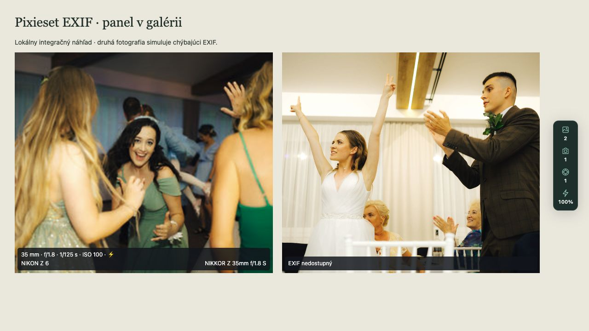
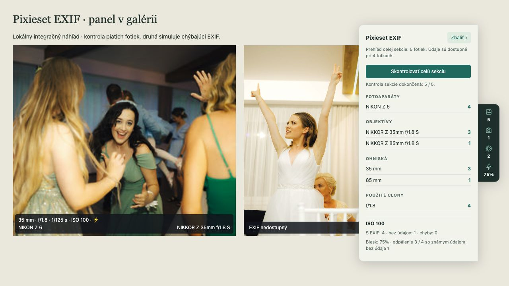

# Pixieset EXIF

Malé rozšírenie pre Arc a Chrome, ktoré pri fotkách v Pixieset galériách zobrazuje ohnisko, clonu, čas, ISO, telo a údaj o blesku.

## Ako to vyzerá

Zbalený panel pri pravom okraji ukazuje počet skontrolovaných fotiek, počet rôznych tiel a objektívov a podiel zaznamenaného blesku. Pri fotkách zostávajú pásiky s EXIF údajmi.



Po kliknutí sa panel rozbalí doľava. Obsahuje telá, objektívy, ohniská, clony, ISO a ovládanie kontroly celej aktuálnej sekcie. Tlačidlo **Zbaliť ›** ho vráti na piktogramy.



Snímky sú z lokálneho testovacieho náhľadu. Rozbalený prehľad ukazuje vzorku piatich fotiek; pri jednej je chýbajúci EXIF simulovaný. Nejde o výsledok celej svadobnej sekcie.

## Inštalácia v Arcu

1. Rozbaľ release ZIP. Vyberáš priečinok obsahujúci `manifest.json`.
2. V Arcu otvor `arc://extensions` (prípadne `chrome://extensions`).
3. Zapni **Developer mode** a klikni na **Load unpacked**.
4. Vyber priečinok s rozšírením (`dist` pri lokálnom builde).
5. Otvor ikonu **Pixieset EXIF** a zapni **Zobrazovať údaje**.
6. Obnov už otvorenú galériu. Údaje sa dopĺňajú pri scrollovaní.

Vypínač platí pre všetky podporované galérie. Predvolene je rozšírenie vypnuté. Po aktualizácii súborov klikni v správe rozšírení na Reload a obnov galériu.

## Verzia 0.4.0

- Prehľad ohnísk v milimetroch a počet fotiek pri každom ohnisku, v paneli aj okne rozšírenia. Ide o zaznamenané ohnisko, bez prepočtu na ekvivalent formátu.
- **Skontrolovať celú sekciu** načíta zoznam fotografií aktuálnej sekcie, potom vybrané EXIF údaje bez scrollovania. Zoznam stránkuje až po výslovné potvrdenie poslednej stránky; neprechádza na ďalšiu sekciu.
- Priebeh, zastavenie a pokračovanie. Doterajšie výsledky sa použijú znova, chyby sa pri ďalšom spustení skúsia načítať znova. Kontrola beží len po kliknutí pri zapnutom rozšírení a pokračuje aj po zatvorení okna rozšírenia.
- Najviac dve súbežné čítania na kartu vrátane čítania viditeľných fotiek. Zastavenie ukončí načítanie zoznamu a plánovanie ďalších fotiek; najviac dve už rozbehnuté EXIF požiadavky môžu dobehnúť do timeoutu, ich výsledky sa po zastavení nepridajú.
- Vypnutie rozšírenia, obnovenie stránky alebo zmena sekcie ukončí kontrolu. Po zmene sekcie sa výsledky a priebeh vymažú.
- Úplné pokrytie sekcie sa zobrazí až po získaní potvrdeného zoznamu a dokončení kontroly. Chýbajúci EXIF a chyby zostávajú rozlíšené; neúspešné načítanie neznamená chýbajúci EXIF. Nepodporované zdroje sa označia samostatne a prehľad nebude označený ako úplný.
- Podporuje klasické Pixieset stránky so sekciou v URL a dostupnou konfiguráciou `PixiesetClient.init`. Pri inom rozložení, obľúbených alebo sťahovacom zozname je tlačidlo nedostupné; ostáva prehľad zo scrollovania. Relácia prehliadača sa používa iba na načítanie zoznamu z aktuálnej Pixieset domény. Neobchádza prihlasovanie ani ochranu galérie.
- Ochranný limit zoznamu: 200 strán po 64 záznamov; chýbajúci koniec alebo opakujúca sa stránka vyvolá chybu. Každá stránka zoznamu má 15-sekundový timeout.

Nový parser, stránkovanie a EXIF kontrola boli overené na 216 fotkách sekcie Svadobná zábava: 216 výsledkov, 0 chýb, 35 mm pri 190 fotkách a 85 mm pri 26 fotkách. Ovládanie bolo overené v lokálnom integračnom náhľade. Používateľ následne potvrdil funkčnosť verzie 0.4.0 priamo v Arcu vrátane prehľadu ohnísk a kontroly celej sekcie.

## Panel v galérii

Po zapnutí sa v galérii zobrazí úzky panel pri pravom okraji, vycentrovaný na výšku okna a odsadený od scrollbaru. Zbalený obsahuje iba piktogramy a čísla: skontrolované fotky, počet rôznych tiel, počet rôznych objektívov a podiel odpáleného blesku zo známych údajov. Význam piktogramov je dostupný po podržaní myši. Kliknutím sa prehľad rozbalí doľava. Kliknutie mimo, Escape alebo tlačidlo **Zbaliť ›** ho vráti na piktogramy. Úplné skrytie je dostupné cez okno rozšírenia. Tlačidlo v okne rozšírenia panel znovu zobrazí. Skrytie platí do obnovenia stránky. Panel má vlastný scroll, izolované štýly a nemení šírku galérie.

## Samostatné okno

Tlačidlo **Samostatné okno ↗** otvorí nastavenia a prehľad v okne, ktoré ostáva otvorené pri scrollovaní galérie. Prehľad sleduje kartu, z ktorej bolo okno otvorené. Pre inú galériu otvor nové okno z jej karty. Po zatvorení zdrojovej karty prehľad nie je dostupný.

- Pásik: ohnisko, použitá clona, čas, ISO a farebný blesk ⚡️ iba pri zaznamenanom odpálení. Pri neznámom údaji je `Blesk: ?`; pri nepoužitom blesku sa nič nezobrazuje.
- Fotoaparát vľavo a dostupný objektív vpravo v druhom riadku.
- Výber zobrazených polí, písmo 10–16 px, krytie pozadia 35–95 % a režim stále / pri prejdení myšou. Nastavenia sa ukladajú lokálne a účinkujú bez obnovenia stránky.
- V okne rozšírenia je prehľad už skontrolovaných fotiek: telá, objektívy, použité clony, rozsah ISO a podiel zaznamenaného blesku.
- Prehľad rozlišuje EXIF, chýbajúce údaje a chyby. Blesk sa počíta iba z fotiek so známym údajom; chyby sa do percenta nepočítajú.
- Náhľad a detail tej istej fotky sa započítajú raz. Prehľad sa obnovuje počas otvoreného okna, ostáva po vypnutí a resetuje sa pri obnovení stránky alebo zmene sekcie.
- Prehľad pokrýva skontrolované fotky v aktuálnej karte. Kontrola celej sekcie sa spúšťa výslovne; celá galéria s ďalšími sekciami sa nekontroluje automaticky. Počet rozpoznaných fotiek je počet unikátnych fotiek práve dostupných v DOM, nie celkový počet galérie.
- Dve súbežné požiadavky na kartu a cache do 500 výsledkov v background workeri. Zmena vzhľadu nespúšťa nové čítanie metadát.
- Číta JPEG z `images.pixieset.com` bez účtu, servera či externého API.
- Po Reload rozšírenia treba obnoviť aj galériu; starý zneplatnený skript sa bezpečne zastaví.

EXIF je záznam fotoaparátu. Blesk bez komunikácie s telom nemusí byť zaznamenaný. „Automatický režim“ nie je potvrdenie TTL. Výkon blesku a MakerNotes táto verzia nečíta. EXIF môže chýbať aj v niektorých rozmerových verziách fotografie; adresy originálov nehádame. Vlastné domény fotografov a iné formáty než JPEG zatiaľ nie sú podporované.

## Vývoj

Node.js 24 LTS, npm.

```sh
npm ci
npm run check
```

Výstup je `dist/`. Stack: TypeScript, esbuild, exifr, Manifest V3, Vitest a jsdom. Používame esbuild namiesto plánovaného Vite: pre tri malé skripty postačuje a znižuje množstvo konfigurácie.

## Súkromie a oprávnenia

Rozšírenie nemá telemetriu a neposiela fotografie žiadnej ďalšej službe. Po zapnutí číta časti fotografií priamo z Pixieset CDN. Neukladá obrazové súbory. Lokálne si pamätá vypínač a vzhľad pásika; pamäťová cache obsahuje len vybrané metadáta a môže sa vymazať pri uspatí service workera. GPS sa neparsuje ani nezobrazuje.

Oprávnenia: skript na `https://*.pixieset.com/*`, čítanie JPEG z `https://images.pixieset.com/*`, lokálne nastavenie cez `storage`. Žiadny prístup ku všetkým webom.

## Overenie

Automatické testy kontrolujú interpretáciu blesku, formátovanie, povolené URL, čiastočné načítanie JPEG, skutočný EXIF parser na syntetickej vzorke, aktiváciu, zmenu zdroja fotografie a vypnutie. Ďalšie testy kontrolujú migráciu nastavení, hover, deduplikáciu, zmenu sekcie, správny menovateľ percenta blesku a ukladanie volieb v okne. Reálne náhľady aj veľká verzia z testovacej galérie boli overené parserom. Súkromné fotografie nie sú súčasťou repozitára.

Verzie 0.1 a 0.4.0 boli používateľom overené v Arcu. Nastavenia, panel a kontrola sekcie boli navyše overené v lokálnom integračnom náhľade so skutočnými skriptmi a adaptérom Chrome API. Automatické testy samy osebe nie sú testom nainštalovaného rozšírenia.

## Ďalšia verzia

Zvýrazňovanie podľa nastavení, prístupnejší detail a viac rozložení Pixiesetu. Výkon blesku až po nájdení vzoriek s podporovanými údajmi výrobcu.
